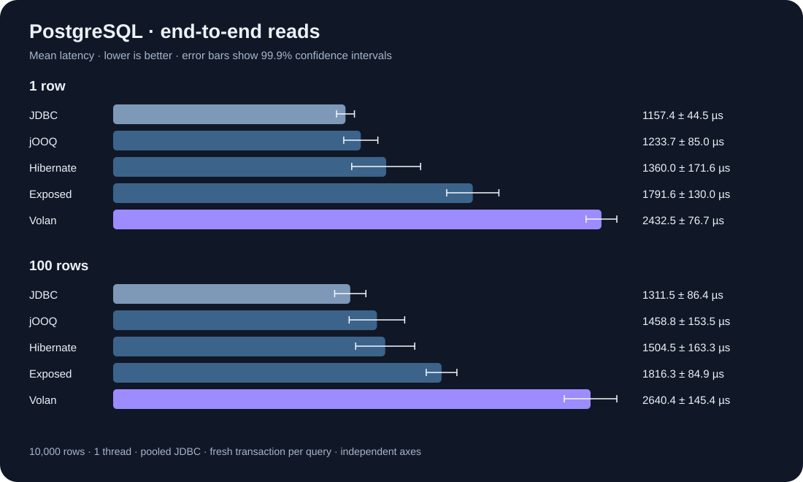

<h1 align="center">Volan</h1>

<p align="center">
  <strong>A schema-first ORM for the JVM.</strong><br>
  Describe your data model once. Get a type-safe client and declarative migrations.
</p>

<p align="center">
  <a href="https://github.com/thirtyeighttwentysix/volan/actions/workflows/ci.yml"></a>
  <a href="LICENSE"></a>
  
  
</p>

---

> **Status: in development, pre-1.0.**
> PostgreSQL CRUD, relations, summaries and migration tooling are implemented. Nothing is published
> to Maven Central yet. See [ROADMAP.md](ROADMAP.md) for what works today and what comes next, and
> [ARCHITECTURE.md](ARCHITECTURE.md) for how it is put together.

## The idea

Volan brings the developer experience of Prisma to the JVM, natively: one readable schema file,
build-time code generation instead of runtime reflection, and a query API where the compiler catches
your typos.

```prisma
// schema.volan
datasource db {
  provider = "postgresql"
  url      = env("DATABASE_URL")
}

model User {
  id        Int      @id @default(autoincrement())
  email     String   @unique
  name      String?
  posts     Post[]
  createdAt DateTime @default(now())

  @@map("users")
}
```

```kotlin
val users = db.user.findMany {
    where {
        email endsWith "@acme.com"
        createdAt gt Instant.now().minus(30.days)
    }
    include { posts { take = 5 } }
    orderBy { createdAt.desc() }
    take = 20
}
```

Java uses the same model and queries (`javaFriendly = true`):

```java
List<User> users = db.getUser().findMany(q -> {
    q.where(w -> w.getEmail().endsWith("@acme.com"));
    q.include(i -> i.posts(p -> p.setTake(5)));
    q.orderBy(o -> o.getCreatedAt().desc());
    q.setTake(20);
});

CompletableFuture<List<User>> pending = db.getUser().findManyAsync(q -> q.setTake(20));
```

## What makes it different

- **Schema-first, not class-first.** The database model is described in one file, not scattered across
  annotations. Migrations are generated by diffing that file against the database.
- **No runtime reflection on the hot path.** Row mapping is generated straight-line code.
- **No hidden queries.** No lazy proxies, no persistence context. `include` costs one extra statement
  per relation level — and the tests assert it.
- **Java is a first-class target.** Generated callbacks, getters, builders, JSpecify nullability and
  `CompletableFuture` operations are tested from Java. [Java API and transactions →](docs/java-api.md)
- **Errors that teach.** Schema problems are reported with a code frame, a caret and a suggested fix.

## ORM and SQL library comparison

| | **Volan** | Hibernate ORM | Exposed | jOOQ |
|---|---|---|---|---|
| Model definition | `.volan` schema | Entity classes | Kotlin tables / entities | Database-generated or dynamic tables |
| Query style | Generated Kotlin DSL / Java callbacks | HQL / Criteria / entity operations | Kotlin DSL / DAO | SQL DSL |
| Row mapping | Generated code | Managed entities | Result rows / DAO entities | Records / explicit mappers |
| Relations | Explicit, batched `include` | Entity associations and fetch plans | DSL joins / DAO references | SQL joins and nested records |
| Nested writes | Generated relation operations | Entity cascades | Application / DAO operations | SQL operations |
| Current Volan scope | PostgreSQL; Kotlin and Java | — | — | — |

These tools offer different abstractions. See the primary references for
[Hibernate](https://docs.hibernate.org/orm/7.4/introduction/),
[Exposed](https://www.jetbrains.com/help/exposed/about.html) and
[jOOQ](https://www.jooq.org/doc/latest/manual/).
Volan includes a migration journal and `db pull` / `db push`;
[Exposed also provides migration utilities](https://www.jetbrains.com/help/exposed/migrations.html).

## Measured performance

The same PostgreSQL table, the same four fields, the same read-committed transaction boundary.
Every adapter materializes its results, and the harness checks their values before timing.



<!-- BENCHMARKS:START -->

| Library | 1 row, µs/op | 100 rows, µs/op |
|---|---:|---:|
| **Volan** | 2432.5 ± 76.7 | 2640.4 ± 145.4 |
| Hibernate | 1360.0 ± 171.6 | 1504.5 ± 163.3 |
| Exposed | 1791.6 ± 130.0 | 1816.3 ± 84.9 |
| jOOQ | 1233.7 ± 85.0 | 1458.8 ± 153.5 |
| JDBC | 1157.4 ± 44.5 | 1311.5 ± 86.4 |

<!-- BENCHMARKS:END -->

**Lower is better.** Values are means ± JMH's 99.9% confidence interval, in microseconds per query.
Measured on 7 September 2026: Ryzen 5 5500, Windows 11, Corretto 25.0.3,
PostgreSQL 17.10 in Docker/WSL2, 10,000 rows, 1 thread, HikariCP pools of 4 connections.
Each case uses 2 JVM forks, 3 × 2 s warmup and 5 × 2 s measurement, with a 512 MiB heap.

This measures pooled reads of 1 or 100 rows over loopback, including transaction and mapping costs.
It does not establish performance for writes, relations or concurrent workloads. Compare confidence
intervals before interpreting small differences.

[Methodology and reproduction](benchmarks/README.md) ·
[Raw results and machine metadata](benchmarks/results/) ·
[Benchmark source](benchmarks/src/main/kotlin/bench/ReadAdapter.kt)

## Migrations

Preview the SQL, apply it, then read the database back as a schema:

```bash
volan db push --schema schema.volan --dry-run
volan db push --schema schema.volan
volan db pull --stdout
```

Push runs in a transaction and verifies the resulting schema before commit. Repeating it makes no
changes. Reviewed SQL files can instead be deployed through `Migrator`, which records checksums and
refuses inconsistent history. [Setup, library API and limitations →](docs/migrations.md)

## Supported databases

**Available:** PostgreSQL. **Planned for M8:** MySQL, MariaDB, SQLite and H2.

## Documentation

- [docs/schema-language.md](docs/schema-language.md) — the `schema.volan` syntax reference
- [docs/java-api.md](docs/java-api.md) — Java queries, async operations and transaction semantics
- [docs/migrations.md](docs/migrations.md) — pull, push, versioned migrations and drift detection
- [benchmarks/README.md](benchmarks/README.md) — performance methodology and reproduction
- [ARCHITECTURE.md](ARCHITECTURE.md) — how Volan is built
- [ROADMAP.md](ROADMAP.md) — milestones and what is deferred
- [docs/adr/](docs/adr/) — architecture decision records
- [CONTRIBUTING.md](CONTRIBUTING.md) — how to build, test and contribute

## Building from source

```bash
git clone https://github.com/thirtyeighttwentysix/volan.git
cd volan
./gradlew build
```

Requires JDK 17 or newer. The Gradle wrapper provisions build dependencies. Docker is required for
the PostgreSQL integration suites and the benchmark database; integration tests are skipped if Docker
is unavailable. Build the CLI with `./gradlew :volan-cli:installDist`.

## Licence

[Apache License 2.0](LICENSE).
