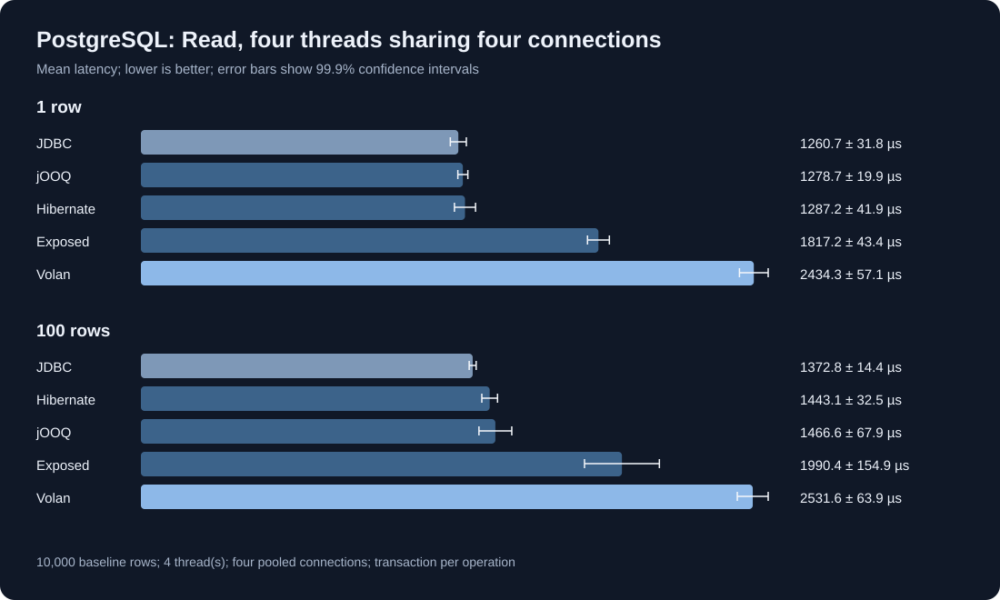
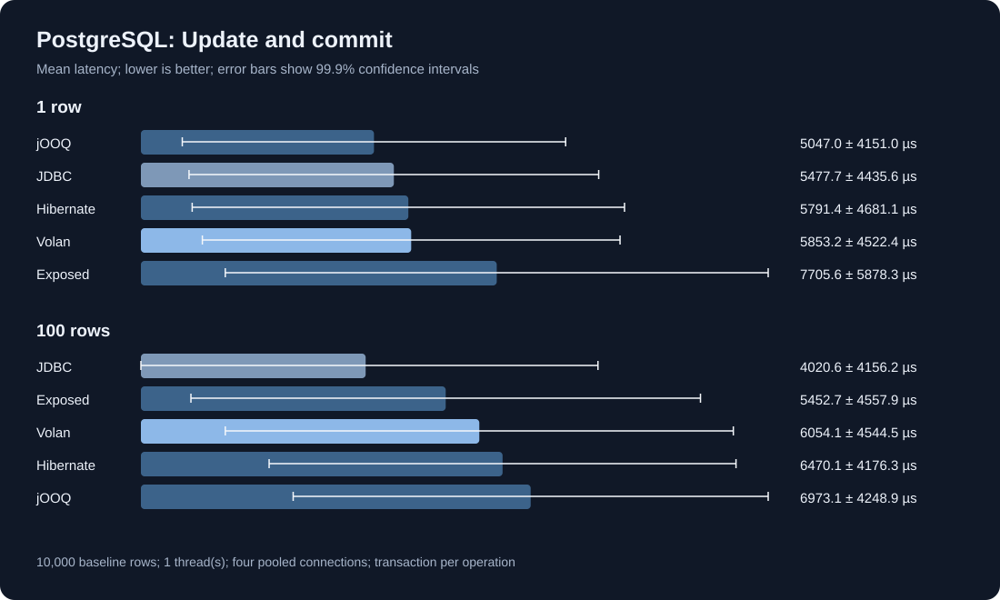
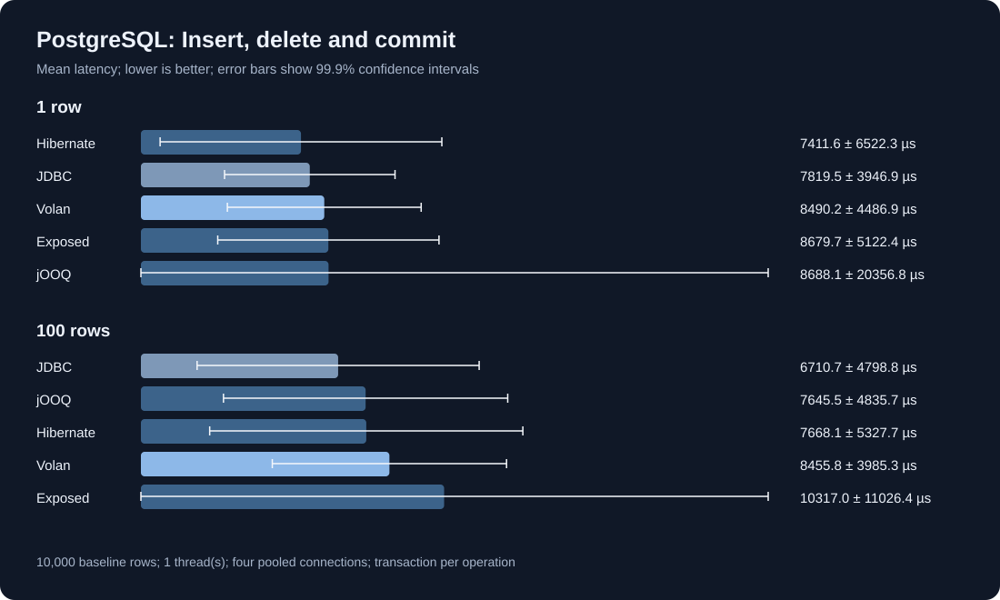

<h1 align="center">Volan</h1>

<p align="center">
  <strong>A schema-first ORM for the JVM.</strong><br>
  Describe your data model once. Get a type-safe client and declarative migrations.
</p>

<p align="center">
  <a href="https://github.com/thirtyeighttwentysix/volan/actions/workflows/ci.yml"></a>
  <a href="LICENSE"></a>
  
  
</p>

---

> **Volan 1.0.0 is available on Maven Central.**
> PostgreSQL, SQLite, H2, MySQL and MariaDB; typed Kotlin/Java clients, automatic Gradle/Maven
> generation, migrations, optional coroutines and query metrics. The CLI is included in the
> [1.0.0 release](https://github.com/thirtyeighttwentysix/volan/releases/tag/v1.0.0).
> Review [database support](docs/dialects.md), [migration guarantees](docs/migrations.md) and
> [known limitations](ROADMAP.md#deliberately-deferred) before choosing a schema or provider.
> [ARCHITECTURE.md](ARCHITECTURE.md) describes the implementation.

## The idea

Volan brings the developer experience of Prisma to the JVM, natively: one readable schema file,
build-time code generation instead of runtime reflection, and a query API where the compiler catches
your typos.

```prisma
// schema.volan
datasource db {
  provider = "postgresql"
  url      = env("DATABASE_URL")
}

model User {
  id        Int      @id @default(autoincrement())
  email     String   @unique
  name      String?
  posts     Post[]
  createdAt DateTime @default(now())

  @@map("users")
}
```

```kotlin
val users = db.user.findMany {
    where {
        email endsWith "@acme.com"
        createdAt gt Instant.now().minus(30.days)
    }
    include { posts { take = 5 } }
    orderBy { createdAt.desc() }
    take = 20
}
```

Java uses the same model and queries (`javaFriendly = true`):

```java
List<User> users = db.getUser().findMany(q -> {
    q.where(w -> w.getEmail().endsWith("@acme.com"));
    q.include(i -> i.posts(p -> p.setTake(5)));
    q.orderBy(o -> o.getCreatedAt().desc());
    q.setTake(20);
});

CompletableFuture<List<User>> pending = db.getUser().findManyAsync(q -> q.setTake(20));
```

## What makes it different

- **Schema-first, not class-first.** The database model is described in one file, not scattered across
  annotations. Migrations are generated by diffing that file against the database.
- **No runtime reflection on the hot path.** Row mapping is generated straight-line code.
- **No hidden queries.** No lazy proxies, no persistence context. `include` costs one extra statement
  per relation level — and the tests assert it.
- **Java is a first-class target.** Generated callbacks, getters, builders, JSpecify nullability and
  `CompletableFuture` operations are tested from Java. [Java API and transactions →](docs/java-api.md)
- **Errors that teach.** Schema problems are reported with a code frame, a caret and a suggested fix.

## ORM and SQL library comparison

| | **Volan** | Hibernate ORM | Exposed | jOOQ |
|---|---|---|---|---|
| Model definition | `.volan` schema | Entity classes | Kotlin tables / entities | Database-generated or dynamic tables |
| Query style | Generated Kotlin DSL / Java callbacks | HQL / Criteria / entity operations | Kotlin DSL / DAO | SQL DSL |
| Row mapping | Generated code | Managed entities | Result rows / DAO entities | Records / explicit mappers |
| Relations | Explicit, batched `include` | Entity associations and fetch plans | DSL joins / DAO references | SQL joins and nested records |
| Nested writes | Generated relation operations | Entity cascades | Application / DAO operations | SQL operations |
| Current Volan scope | PostgreSQL, SQLite, H2, MySQL and MariaDB in 1.0.0; Kotlin and Java | — | — | — |

These tools offer different abstractions. See the primary references for
[Hibernate](https://docs.hibernate.org/orm/7.4/introduction/),
[Exposed](https://www.jetbrains.com/help/exposed/about.html) and
[jOOQ](https://www.jooq.org/doc/latest/manual/).
Volan includes a migration journal and `db pull` / `db push`;
[Exposed also provides migration utilities](https://www.jetbrains.com/help/exposed/migrations.html).

## Measured performance

Forty PostgreSQL cases compare reads, four concurrent readers, range updates and insert/delete
transactions. Every adapter uses the same table shape, four fields and read-committed transaction
boundary. The harness checks values, affected counts and final database state before timing.


<!-- BENCHMARKS:START -->

**Read, one thread**

| Library | 1 row, µs/op | 100 rows, µs/op |
|---|---:|---:|
| **Volan** | 2191.2 ± 80.3 | 2232.7 ± 35.0 |
| Hibernate | 1165.0 ± 94.4 | 1281.7 ± 53.7 |
| Exposed | 1580.1 ± 25.1 | 1726.9 ± 85.0 |
| jOOQ | 1160.3 ± 40.3 | 1259.0 ± 56.6 |
| JDBC | 1103.5 ± 23.0 | 1198.7 ± 31.7 |

**Read, four threads sharing four connections**

| Library | 1 row, µs/op | 100 rows, µs/op |
|---|---:|---:|
| **Volan** | 2434.3 ± 57.1 | 2531.6 ± 63.9 |
| Hibernate | 1287.2 ± 41.9 | 1443.1 ± 32.5 |
| Exposed | 1817.2 ± 43.4 | 1990.4 ± 154.9 |
| jOOQ | 1278.7 ± 19.9 | 1466.6 ± 67.9 |
| JDBC | 1260.7 ± 31.8 | 1372.8 ± 14.4 |

**Update and commit**

| Library | 1 row, µs/op | 100 rows, µs/op |
|---|---:|---:|
| **Volan** | 5853.2 ± 4522.4 | 6054.1 ± 4544.5 |
| Hibernate | 5791.4 ± 4681.1 | 6470.1 ± 4176.3 |
| Exposed | 7705.6 ± 5878.3 | 5452.7 ± 4557.9 |
| jOOQ | 5047.0 ± 4151.0 | 6973.1 ± 4248.9 |
| JDBC | 5477.7 ± 4435.6 | 4020.6 ± 4156.2 |

**Insert, delete and commit**

| Library | 1 row, µs/op | 100 rows, µs/op |
|---|---:|---:|
| **Volan** | 8490.2 ± 4486.9 | 8455.8 ± 3985.3 |
| Hibernate | 7411.6 ± 6522.3 | 7668.1 ± 5327.7 |
| Exposed | 8679.7 ± 5122.4 | 10317.0 ± 11026.4 |
| jOOQ | 8688.1 ± 20356.8 | 7645.5 ± 4835.7 |
| JDBC | 7819.5 ± 3946.9 | 6710.7 ± 4798.8 |

<!-- BENCHMARKS:END -->

**Lower is better.** Values are means ± JMH's 99.9% confidence interval, in microseconds per operation.
Measured on 5 October 2026: Ryzen 5 5500, Windows 11, Corretto 25.0.3,
PostgreSQL 17.10 in Docker/WSL2, 10,000 baseline rows and HikariCP pools of 4 connections.
Each case uses 2 JVM forks, 3 × 2 s warmup and 5 × 2 s measurement, with a 512 MiB heap.

Volan has higher read latency in this run. **Write intervals are wide and overlap heavily**, so
their means do not support a reliable ranking. Four-thread values are latency per caller, not
aggregate throughput. Insert/delete includes both operations and one commit; it is not an
insert-only score. Libraries use the documented bulk strategies, including Hibernate/Exposed
JDBC batches and multi-row inserts for Volan/jOOQ/JDBC.

<details>
<summary>Concurrent read and write charts</summary>





</details>

Results include loopback network, pooling and transaction costs. They do not establish performance
for relations, nested writes, generated IDs, migrations or another database deployment.

[Methodology and reproduction](benchmarks/README.md) ·
[Raw results and machine metadata](benchmarks/results/) ·
[Benchmark source](benchmarks/src/main/kotlin/bench/ReadAdapter.kt)

## Examples

Independent projects demonstrate [Kotlin](examples/kotlin-basic/README.md),
[Java](examples/java-basic/README.md), [Spring Boot](examples/spring-boot/README.md) and
[Ktor](examples/ktor/README.md), including automatic generation, committed migrations and
client lifecycle. They resolve version 1.0.0 from Maven Central; no local artifact staging is needed.
The [release verification](docs/release-readiness.md) records the checks performed before and after publication.

## Coroutines and observability

Optional `volan-coroutines` provides typed `suspendQuery` access to generated
clients and repositories. Coroutine cancellation requests JDBC statement cancellation and waits for
resource cleanup; entire transactions execute on one worker. Statement interceptors cover generated
queries, relations and raw SQL, and optional `volan-micrometer` records duration/count with bounded
provider, operation and outcome tags. Add either module separately, aligned by the 1.0.0 BOM.
[Setup and cancellation semantics →](docs/coroutines-and-observability.md)

## Migrations

Preview the SQL, apply it, then read the database back as a schema:

```bash
volan db push --schema schema.volan --dry-run
volan db push --schema schema.volan
volan db pull --stdout
```

PostgreSQL and SQLite push run in a transaction and verify the resulting schema before commit. Repeating push makes no
changes. Reviewed SQL files can instead be deployed through `Migrator`, which records checksums and
refuses inconsistent history. [Setup, library API and limitations →](docs/migrations.md)

## Supported databases

**Available in 1.0.0:** PostgreSQL, SQLite, H2, MySQL and MariaDB with generated queries, relations,
transactions, DDL, pull/push and versioned migrations. H2, MySQL and MariaDB have recoverable journals.
H2/MySQL/MariaDB DDL commits immediately; interrupted changes require manual repair.
[Feature matrix, setup and limitations →](docs/dialects.md)

## Maven Central

Configure plugin repositories in `settings.gradle.kts`:

```kotlin
pluginManagement {
    repositories {
        mavenCentral()
        gradlePluginPortal() // Kotlin compiler plugin
    }
}
```

Then add the plugin and your database dependencies to `build.gradle.kts`:

```kotlin
plugins {
    kotlin("jvm") version "2.4.20"
    id("io.github.thirtyeighttwentysix.volan") version "1.0.0"
}
repositories { mavenCentral() }
dependencies {
    implementation(platform("io.github.thirtyeighttwentysix:volan-bom:1.0.0"))
    implementation("io.github.thirtyeighttwentysix:volan-dialect-postgres")
    runtimeOnly("org.postgresql:postgresql:42.7.13")
}
```

Add `schema.volan` with a `volan-kotlin` generator and run `./gradlew build`. The plugin supplies
the matching runtime and generates the client before compilation, without a database connection.
Database changes remain explicit. Java consumers also compile generated Kotlin through the Kotlin
compiler. Maven projects use `volan-maven-plugin:1.0.0` during `generate-sources`.
[Complete Gradle/Maven setup and CLI commands →](docs/build-plugins.md)

## Install the CLI / Установка CLI

**Windows (PowerShell):**

```powershell
& ([scriptblock]::Create((irm https://raw.githubusercontent.com/thirtyeighttwentysix/volan/main/scripts/install.ps1)))
```

**Linux / macOS:**

```bash
curl -fsSL https://raw.githubusercontent.com/thirtyeighttwentysix/volan/main/scripts/install.sh | bash
```

Requires **Java 17+**. Downloads the CLI, verifies SHA-256 and adds `volan` to your user `PATH`
without administrator privileges. Run the same command to upgrade. Open a new terminal on Linux/macOS,
then run `volan --help`. The installer selects the CLI from the `v1.0.0` release.

Нужна **Java 17+**. Установщик скачает CLI, проверит SHA-256 и добавит `volan` в `PATH` без прав
администратора. Та же команда обновляет CLI. На Linux/macOS открой новый терминал и выполни
`volan --help`. Установщик выбирает CLI из релиза `v1.0.0`; библиотеки 1.0.0 доступны в Maven Central.

[Versions, custom paths and removal / Версии, каталог установки и удаление →](docs/cli-installation.md)

## Documentation

- [English documentation](https://volan.mintlify.app/en/introduction)
- [Документация на русском](https://volan.mintlify.app/ru/introduction)

- [docs/schema-language.md](docs/schema-language.md) — the `schema.volan` syntax reference
- [docs/java-api.md](docs/java-api.md) — Java queries, async operations and transaction semantics
- [docs/migrations.md](docs/migrations.md) — pull, push, versioned migrations and drift detection
- [docs/dialects.md](docs/dialects.md) — database feature matrix and SQLite storage conventions
- [docs/build-plugins.md](docs/build-plugins.md) — CLI commands and automatic Gradle/Maven generation
- [docs/cli-installation.md](docs/cli-installation.md) — install and upgrade the CLI on Windows, Linux and macOS
- [benchmarks/README.md](benchmarks/README.md) — performance methodology and reproduction
- [ARCHITECTURE.md](ARCHITECTURE.md) — how Volan is built
- [ROADMAP.md](ROADMAP.md) — milestones and what is deferred
- [docs/adr/](docs/adr/) — architecture decision records
- [CONTRIBUTING.md](CONTRIBUTING.md) — how to build, test and contribute

## Building from source

```bash
git clone https://github.com/thirtyeighttwentysix/volan.git
cd volan
./gradlew build
```

Requires JDK 17 or newer. The Gradle wrapper provisions build dependencies. Docker is required for
the PostgreSQL integration suites and the benchmark database; integration tests are skipped if Docker
is unavailable. Build the CLI with `./gradlew :volan-cli:installDist`.

## Support development / Поддержать разработку

### English

If Volan is useful to you, you can support its development. Donations help me spend more time on
new features, database support, tests and documentation. Thank you for helping the project grow!

### Русский

Если Volan тебе полезен, ты можешь поддержать его разработку. Донаты помогают мне уделять больше
времени новым возможностям, поддержке баз данных, тестам и документации. Спасибо за поддержку проекта!

<p align="center">
  <a href="https://pay.cloudtips.ru/p/b05a329d"></a>
</p>

<p align="center">
  <a href="https://pay.cloudtips.ru/p/b05a329d">Donate via CloudTips · Поддержать через CloudTips</a>
</p>

### Crypto / Криптовалюта

| Asset / Валюта | Network / Сеть | Wallet address / Адрес кошелька |
|---|---|---|
| **GRAM** | TON | `UQAIjKkz-_UKju3uxH_ixEbk_10ha_qNl8LwHM7rwLVYlWdD` |
| **USDT (Tether)** | TRON (TRC20) | `TArsteJh5PmWk9qzY3rhE5L8L1znVhZt3E` |
| **SOL** | Solana | `EGGK8uTCYc7YDorXHLUzZQduj3zubzuiXYU2wKY2ii8W` |

## Licence

[Apache License 2.0](LICENSE).
